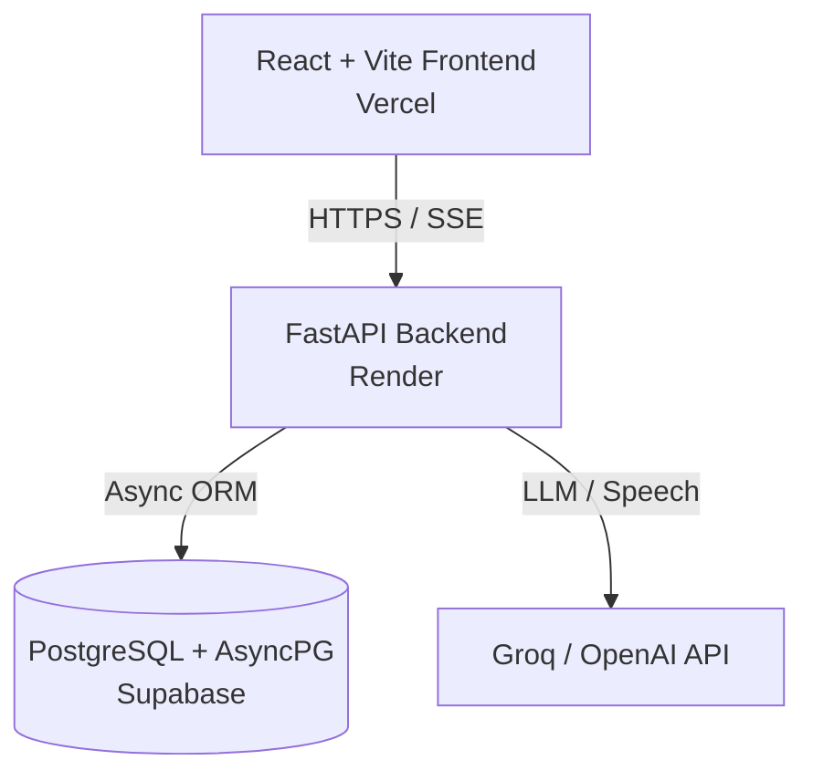

# 🌟 LinguaMate AI

<div align="center">

  

  **Your AI-Powered English Speaking Companion & Language Learning Platform**

  [](https://liguamate.vercel.app/)
  [](https://liguamate.onrender.com)
  [](https://supabase.com)
  [](LICENSE)

  [Live Frontend](https://liguamate.vercel.app/) • [API Endpoint](https://liguamate.onrender.com) • [Report Bug](https://github.com/Dev7570/liguamate/issues)

</div>

---

## 📖 Overview

**LinguaMate AI** is a state-of-the-art language learning application designed to build conversational English fluency through natural AI interactions. Rather than static textbook drills, LinguaMate provides an interactive companion (**Mira**) who remembers your life context, corrects your grammar seamlessly in real-time, leads immersive 3D roleplay scenarios, and adapts vocabulary progression through scientifically backed Spaced Repetition (SRS).

---

## ✨ Key Features

### 🎨 3D Interactive Front Page & Roleplay Scenes
- **Dynamic 3D Canvas**: Built using `@react-three/fiber` & `@react-three/drei` with distorted mesh geometries, interactive lighting, and glowing starfield particles.
- **Context-Aware 3D Environments**: Ambient 3D themes (Coffee Shop ☕, Airport Terminal ✈️, Tech Interview 💼, Road Trip 🚗) that render smoothly behind glassmorphic chat interface cards.

### 🎙️ Real-Time Voice & Speech Interaction
- **Speech-to-Text**: Record voice messages directly using native Web Speech API & Whisper speech recognition.
- **Text-to-Speech (TTS)**: Listen to Mira speak responses aloud with natural vocal inflection.

### 🧠 Intelligent Conversational Pipeline & Memory
- **Long-Term Memory**: Automatic signal extraction remembers your hobbies, job details, and daily goals.
- **Inline Grammar Corrections**: Non-intrusive correction cards appear inline below user messages showing exact grammar fixes (`I goes` → `I go`) with helpful explanations.
- **Vocabulary Signal Extraction**: Automatically detects target vocabulary used in conversation and tracks user progress.

### 📈 Spaced Repetition System (SRS)
- **SuperMemo-2 (SM-2) Integration**: Calculates optimal review intervals based on user word usage frequency and recall success.
- **Smart Vocabulary Dashboard**: Automatically prioritizes words that are due for review.

### 🎮 Gamified Learning & Social Leaderboards
- **Interactive Minigames**: Word Match & Fill-in-the-Blanks games powered by your active vocabulary pool.
- **Global Leaderboard**: Compete globally for XP, level titles, and daily learning streaks.
- **Daily Missions**: Level-appropriate daily speaking challenges.

---

## 🛠️ Architecture & Tech Stack



### **Frontend**
- **Framework**: React 19 + Vite
- **Styling**: Pure Modern Vanilla CSS (Glassmorphism design system, CSS variables, dark mode)
- **3D Graphics**: Three.js, `@react-three/fiber`, `@react-three/drei`
- **Icons & UI**: Lucide Icons, Canvas Animations

### **Backend**
- **Framework**: Python 3.11 + FastAPI (Asynchronous)
- **ORM / Database**: SQLAlchemy 2.0 (AsyncIO) + `asyncpg` + Alembic
- **AI Orchestration**: Groq API (Llama 3.3 70B Versatile) / OpenAI API (GPT-4o)
- **Authentication**: JWT Tokens + Passlib (bcrypt)

### **Infrastructure**
- **Frontend Hosting**: Vercel
- **Backend Hosting**: Render (Web Service)
- **Database**: Supabase Cloud PostgreSQL

---

## 🚀 Quick Start (Local Setup)

### Prerequisites
- Node.js 18+
- Python 3.11+
- Git

### 1. Clone Repository
```bash
git clone https://github.com/Dev7570/liguamate.git
cd liguamate
```

### 2. Backend Setup
```bash
cd backend

# Create & activate virtual environment
python -m venv venv
# On Windows:
venv\Scripts\activate
# On Mac/Linux:
# source venv/bin/activate

# Install dependencies
pip install -r requirements.txt

# Copy environment template
cp .env.example .env
```

Configure your `.env` inside `backend/`:
```env
DATABASE_URL=sqlite+aiosqlite:///./linguamate.db
SECRET_KEY=your_super_secret_jwt_key
GROQ_API_KEY=gsk_your_groq_api_key
```

Initialize the local database:
```bash
python init_db.py
```

Start the FastAPI server:
```bash
uvicorn app.main:app --reload --port 8000
```

### 3. Frontend Setup
In a new terminal window:
```bash
cd frontend

# Install packages
npm install

# Start Vite dev server
npm run dev
```

Visit `http://localhost:5173` in your browser!

---

## 🌐 Live Deployment Configuration

### Environment Variables Matrix

| Variable | Description | Environment |
|---|---|---|
| `VITE_API_URL` | Live Backend Endpoint | Frontend (Vercel) |
| `DATABASE_URL` | PostgreSQL Async Connection String | Backend (Render) |
| `GROQ_API_KEY` | LLM Inference API Key | Backend (Render) |
| `SECRET_KEY` | JWT Auth Signature Key | Backend (Render) |
| `FRONTEND_URL` | Allowed CORS Origin | Backend (Render) |

---

## 📁 Repository Structure

```
linguamate/
├── frontend/                  # React Vite Frontend Application
│   ├── public/                # Static assets & icons
│   ├── src/
│   │   ├── assets/            # Media assets & textures
│   │   ├── components/        # 3D Scenes, Chat UI, Games
│   │   ├── context/           # Auth Context Provider
│   │   ├── pages/             # Landing, Chat, Dashboard, Tasks, Activities
│   │   ├── services/          # API & Streaming Service
│   │   └── styles/            # Modular Design System (Glassmorphism)
│   └── vite.config.js
│
├── backend/                   # FastAPI Backend Application
│   ├── app/
│   │   ├── models/            # SQLAlchemy Async Models (User, Vocab, Conv, Tasks)
│   │   ├── routers/           # Auth, Chat, Activities, Tasks, Progress APIs
│   │   ├── schemas/           # Pydantic Schemas
│   │   ├── services/          # AI Pipeline, SRS Engine, Memory & Games Logic
│   │   └── utils/             # Auth & Embeddings helpers
│   ├── init_db.py             # Database Initialization Script
│   └── requirements.txt       # Python Dependencies
│
├── render.yaml                # Render Infrastructure-as-Code Blueprint
└── README.md
```

---

## 🤝 Contributing

Contributions are welcome! Feel free to open an issue or submit a pull request:

1. Fork the Project
2. Create your Feature Branch (`git checkout -b feature/AmazingFeature`)
3. Commit your Changes (`git commit -m 'Add some AmazingFeature'`)
4. Push to the Branch (`git push origin feature/AmazingFeature`)
5. Open a Pull Request

---

## 📄 License

Distributed under the MIT License. See `LICENSE` for more information.

<div align="center">
  Crafted with ❤️ for English learners worldwide.
</div>
